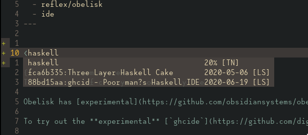
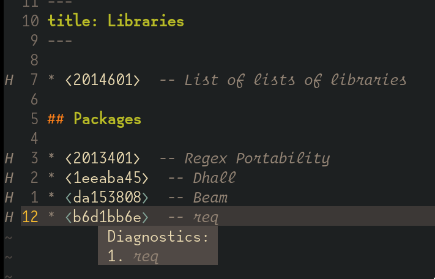

# neuron-language-server
Language server for [neuron](https://github.com/srid/neuron).

Neuron will embed language server in neuron. Check [sric/neuron#213](https://github.com/srid/neuron/issues/213) for updates.<br/> 
This is just an personal experiment.

Supports
- textDocument/completion(search by title/id)<br/>
  
- textDocument/definition
- textDocument/hover<br/>
  
- textDocument/publishDiagnostics<br/>
  <br/>
  Virtual text is available with [nvim-lsp](https://github.com/neovim/nvim-lsp)


#### TODO
* [Renaming tag](https://github.com/srid/neuron/issues/213#issuecomment-648885576)

* improve completion

* LSP snippets
    - header snippets?

* textDocument/codeAction<br/>
  https://github.com/felko/neuron-mode has some awesome features that might be converted to code actions.


#### Prerequisites
  - neuron

#### Installation
```
go get -u github.com/aca/neuron-language-server
# Or: nix-build (if you have Nix)
```

#### LSP client settings
- vim/neovim, [coc.nvim](https://github.com/neoclide/coc.nvim)
  ```
  "languageserver": {
    "neuron": {
      "command": "neuron-language-server",
      "filetypes": ["markdown"]
    },
  ```
- neovim, [nvim-lsp](https://github.com/neovim/nvim-lsp)
  ```lua
  local nvim_lsp = require('nvim_lsp')
  local configs = require('nvim_lsp/configs')

  configs.neuron_ls = {
    default_config = {
      cmd = {'neuron-language-server'};
      filetypes = {'markdown'};
      root_dir = function()
        return vim.loop.cwd()
      end;
      settings = {};
    };
  }
  nvim_lsp.neuron_ls.setup{}
  ```
